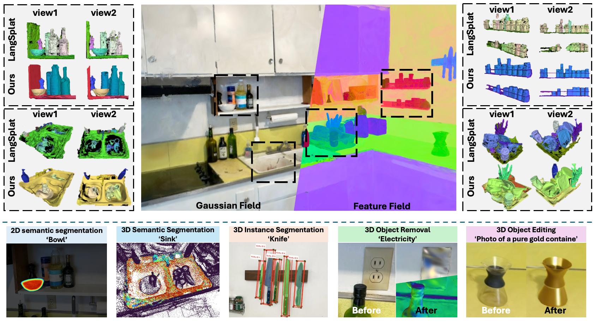

# LangSurf: Language-Embedded Surface Gaussians for 3D Scene Understanding
[**Webpage**](https://langsurf.github.io/) | [**Full Paper**](https://arxiv.org/pdf/2312.16084.pdf) | [**Video**](https://www.youtube.com/watch?v=XMlyjsei-Es)<br>

[Hao Li*](https://lifuguan.github.io/), [Roy Qin*†](https://minghanqin.github.io/), Zhengyu Zou*, Diqi He, Bohan Li, Bingquan Dai, [Dingwen Zhang†](https://vision-intelligence.com.cn), Junwei Han<br>(\* indicates equal contribution, † means Co-corresponding author)<br>



## Todo List
- [ ] Release the preprocessed data.
- [ ] Release the training & inference code.
- [ ] Release all model checkpoints.
- [ ] Release the object removal & adding code.
- [ ] Release the object editing code.


## Acknowledgement
We would like to express our gratitude to the authors of the following algorithms and libraries, which have greatly inspired and supported this project:

- [Segment Anything](https://github.com/facebookresearch/segment-anything)
- [CLIP](https://arxiv.org/abs/2103.00020)
- [LangSplat: 3D Language Gaussian Splatting](https://github.com/minghanqin/LangSplat)
- [PGSR: Planar-based Gaussian Splatting for Efficient and High-Fidelity Surface Reconstruction](https://github.com/zju3dv/PGSR)


Your contributions to the open-source community have been invaluable and are deeply appreciated.

## BibTeX

```bibtex
li2024langsurflanguageembeddedsurfacegaussians,
      title={LangSurf: Language-Embedded Surface Gaussians for 3D Scene Understanding}, 
      author={Hao Li and Roy Qin and Zhengyu Zou and Diqi He and Bohan Li and Bingquan Dai and Dingewn Zhang and Junwei Han},
      year={2024},
      eprint={2412.17635},
      archivePrefix={arXiv},
      primaryClass={cs.CV},
      url={https://arxiv.org/abs/2412.17635
```
